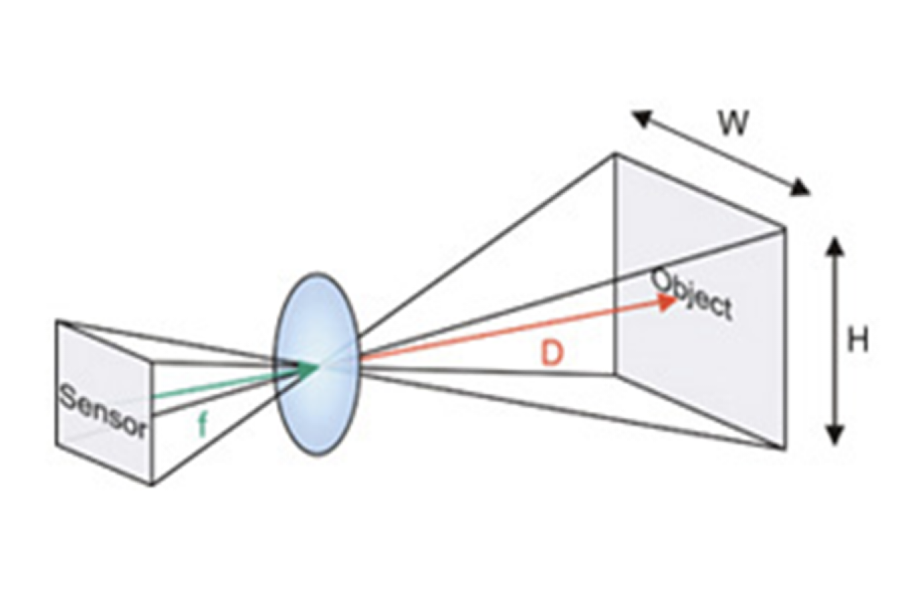
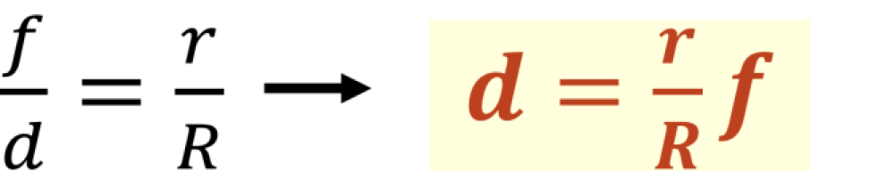
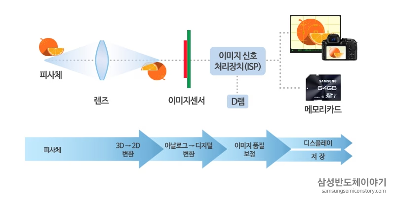

# 시각장애인을 위한 도로 위 안전한 보행 보조 어플리케이션 EyeKeeper 👀

[주요 개발 기능] 도로 위 공유 킥보드/자전거를 실시간 객체 탐지하고 광학 이론의 초점거리 공식을 이용하여 사용자와 장애물까지와의 거리/방향을 제공한다. 

## 초점거리 공식을 이용한 장애물까지와의 거리 계산 알고리즘 

### 거리 측정 알고리즘



> r: 객체 박스 높이  
R: 실제 객체 높이  
f: 초점 거리 (focal length)  
d: 실제 거리 **구해야 하는 값**

거리 측정 알고리즘은, 이미지에서 감지된 객체의 픽셀 개수와 실제 객체 높이, 초점거리의 비례를 이용하여 실제 거리를 계산하는 로직이다. 

광학 이론에서 아이디어를 얻어 해당 알고리즘으로 개발을 진행하면서, 크기의 오차가 있어 알고리즘을 고도화하였다. 

### 고도화한 거리 측정 알고리즘

이미지 센서마다 크기가 다 다르기 때문에, r(객체 박스 높이, 즉 픽셀 갯수)만으로는 정확한 높이를 구할 수 없다. 

추가적으로 객체 박스 높이를 실제 mm로 정의하여 보다 더 정확한 Real distance를 측정하도록 로직을 고도화하였다. 

#### 초점 거리와, 이미지 센서 크기를 얻는 로직 
```java
CameraManager manager = (CameraManager) getSystemService(CAMERA_SERVICE);

try {
    CameraCharacteristics characteristics = manager.getCameraCharacteristics("0");

    // 초점 거리 얻기
    float[] maxFocus = characteristics.get(CameraCharacteristics.LENS_INFO_AVAILABLE_FOCAL_LENGTHS);
    if (maxFocus != null && maxFocus.length > 0) {
        focalLength = maxFocus[0];
    }

    // 이미지 센서 크기 얻기
    SizeF size = characteristics.get(CameraCharacteristics.SENSOR_INFO_PHYSICAL_SIZE);
    if (size != null) {
        sensor_height = size.getHeight();
    }
} catch (CameraAccessException e) {
    e.printStackTrace();
}
```

#### 광학 원리를 통해 실제 거리를 측정하는 로직
```
dist = focalLength * realSize * preview_height / (object_height * sensor_height); 
```

## 실시간 DNN 속도 저하 최적화

서버 없이 어플리케이션 단에서 모든 프레임마다 객체를 탐지하는 DNN Layer를 통과하며 FPS가 매우 느린 문제를, 코드 로직 수정으로 개선하였다. 

> onCameraFrame(inputFrame) 함수는 콜백 함수로 프레임을 받을 때마다 자동으로 호출된다. 

현재 로직에서 DNN 연산이 필요하지 않으면, 바로 반환하여 불필요한 YOLO 실행을 방지한다. 

```java
@Override
public Mat onCameraFrame(CameraBridgeViewBase.CvCameraViewFrame inputFrame) {
    Mat frame = inputFrame.rgba();

    if (firstTime) {
        preview_height = frame.height();
        tts.speak("보행모드가 실행됩니다.", TextToSpeech.QUEUE_FLUSH, null);
        firstTime = false;
        return frame;
    }

    // DNN 연산이 필요하지 않으면 바로 반환하여 불필요한 YOLO 실행 방지
    if (!detection) {
        return frame;
    }
    detection = false;  // YOLO 연산 후 다시 비활성화

    // YOLO DNN 실행 (최적화 적용)
    Mat imageBlob = Dnn.blobFromImage(frame, 0.00392, new Size(416, 416), new Scalar(0, 0, 0), false, false);
    tinyYolo.setInput(imageBlob);

    List<Mat> result = new ArrayList<>();
    tinyYolo.forward(result, Arrays.asList("yolo_16", "yolo_23"));

    // 객체 검출 후 NMS(Non-Maximum Suppression) 적용하여 최종 박스 선택
    float confThreshold = 0.3f, nmsThresh = 0.1f;
    List<Rect> rects = new ArrayList<>();
    List<Float> confs = new ArrayList<>();
    for (Mat level : result) {
        for (int j = 0; j < level.rows(); j++) {
            Mat row = level.row(j);
            float confidence = (float) Core.minMaxLoc(row.colRange(5, level.cols())).maxVal;
            if (confidence > confThreshold) {
                int x = (int) (row.get(0, 0)[0] * frame.cols());
                int y = (int) (row.get(0, 1)[0] * frame.rows());
                int w = (int) (row.get(0, 2)[0] * frame.cols());
                int h = (int) (row.get(0, 3)[0] * frame.rows());
                rects.add(new Rect(x - w / 2, y - h / 2, w, h));
                confs.add(confidence);
            }
        }
    }

    if (!rects.isEmpty()) {
        MatOfRect boxes = new MatOfRect(rects.toArray(new Rect[0]));
        MatOfFloat confidences = new MatOfFloat(Converters.vector_float_to_Mat(confs));
        MatOfInt indices = new MatOfInt();
        Dnn.NMSBoxes(boxes, confidences, confThreshold, nmsThresh, indices);

        // 가장 큰 객체 검출 후 사각형 표시
        int[] ind = indices.toArray();
        Rect maxBox = null;
        int maxHeight = -1;
        for (int idx : ind) {
            Rect box = rects.get(idx);
            if (maxHeight < box.height) {
                maxHeight = box.height;
                maxBox = box;
            }
        }
        if (maxBox != null) {
            Imgproc.rectangle(frame, maxBox.tl(), maxBox.br(), new Scalar(255, 0, 0), 2);
        }
    }

    return frame;
}

```
